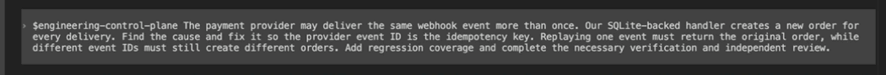

# rd-skills

rd-skills helps AI coding tools turn a plain-language engineering request into a scoped, tested, independently checked change.

## Why rd-skills

Ordinary AI coding often looks like this:

```text
request → find code → edit → run a test → done
```

rd-skills adds the engineering work that makes a change easier to trust:

```text
request
→ understand the repository boundary
→ use the right professional guidance
→ change the right owner
→ verify the actual risk
→ independently check the change
→ finish only with current results
```

You describe the problem. rd-skills carries the process.

## Demo

A duplicate-order webhook bug, fixed from one natural-language request with targeted tests and an independent review.



## Install

Requirements: Python 3.11 or newer and a checkout of this repository. From the repository root:

```bash
python3 -m pip install .
python3 scripts/quickstart.py --agent codex --scope user
```

That command builds the current checkout, installs it for Codex, and checks the installed files. Other tools and project-local installation are covered in [Quickstart](docs/QUICKSTART.md).

## First task

Open or restart Codex, then enter:

```text
$engineering-control-plane

Payment callbacks sometimes create the same order twice.
Find the cause and fix it. Add the necessary regression test and verify the change.
```

Invocation syntax is host-specific. Codex uses `$engineering-control-plane`; see the [Quickstart host invocation table](docs/QUICKSTART.md#host-invocation) for verified Claude Code and Copilot CLI syntax, Cline's current limitation, and OpenAI API packaging.

You can add paths, acceptance criteria, constraints, or a test command when you know them. You do not need to investigate the repository first.

## What rd-skills does

For an implementation request, rd-skills:

- reads the current code before changing it;
- finds the owning code and checks nearby consumers;
- applies guidance suited to the task and its risks;
- makes the smallest complete change it can support;
- validates after the final edit;
- asks a separate reviewer to inspect the actual change; and
- reports changed files, results, limits, and any decision still needed from you.

If ownership, safety, or impact is unclear, it investigates first. It stops before destructive, privileged, production, or out-of-scope actions that need your decision.

## Supported hosts

Supported hosts are `codex`, `claude`, `copilot`, `cline`, and `openai-api`.

| Tool | Personal setup | Project setup | Notes |
| --- | --- | --- | --- |
| Codex | yes | yes | Also supports an explicitly authorized admin scope. |
| Claude | yes | yes | Restart the tool after installation. |
| GitHub Copilot | yes | yes | Host capabilities depend on the active Copilot environment. |
| Cline | yes | yes | Install/build target only; the current host contract does not establish live Skill loading or workflow behavior. |
| OpenAI API | package output | n/a | Produces local zip packages; it does not install into a live host. |

Project scope requires `--target` with the project root. Exact paths, scopes, and recovery rules live in [Advanced Installation & Recovery](docs/INSTALLATION.md).

## Get started

Follow [Quickstart](docs/QUICKSTART.md) from a fresh checkout to a verified installation and first task.

## Usage

See [Usage](docs/USAGE.md) for everyday prompts, useful optional context, result interpretation, common questions, and troubleshooting.

## Learn more

- [Documentation map](docs/README.md)
- [Advanced Installation & Recovery](docs/INSTALLATION.md)
- [How the system is structured](docs/HOOKLESS_ARCHITECTURE.md)
- [Support](SUPPORT.md)

This repository authors and validates rd-skills. Install built artifacts from `dist/`; never install `src/` directly.

Static panel evidence does not prove real-host Profile startup, wall-clock performance, provider behavior, production accuracy, or installed user experience.

Community policies: [Contributing](CONTRIBUTING.md), [Governance](GOVERNANCE.md), [Security](SECURITY.md), and [Code of Conduct](CODE_OF_CONDUCT.md).
